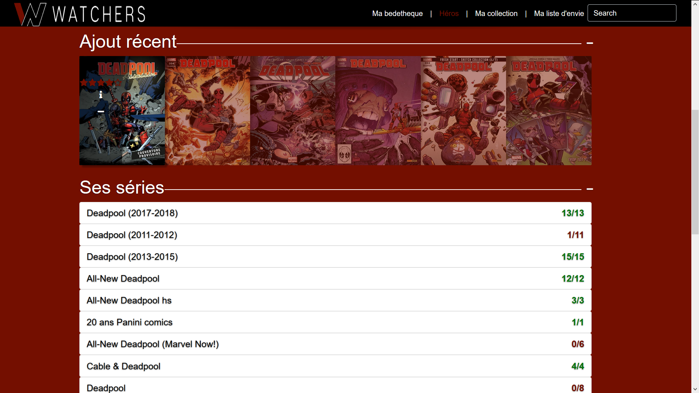

# Watchers-php-version

## Info générale

Whatchers est un projet personnel, c'est une bibliothèque en ligne spécialisée dans les comics. Elle permet à un utilisateur de créer sa 
bibliothèque de comics en ligne, d'ajouter ses comics, d'avoir des infos sur sa collection (par exemple le cout totale de sa collection,
le cout total pour terminer toutes ses séries ou encore ses heros préférés). Il est réalisé avec  illuminate/database:"5.0.0", slim/slim:"2.0.0",
php:">=5.4.0", javascript, jquery, Material Design for Bootstrap.

### Il n'est pas tout à fait fini, il reste des bugs.

## Captures
Voici une capture de la page d'accueil qui propose des wallpapers aléatoires

Ci-dessous vous pouvez voir la page de connexion.

Puis la page d'accueil de votre bibliothèque, qui vous permet d'avoir accès à nombreuses statistiques, vos 5 derniers ajouts,
un graphique qui indique vos achats des 5 derniers mois, d'ajouter des comics grace 0 l'isbn ...

Voici une capture de la liste des héros puis du detail d'un héros

Ensuite la page de detail d'un comics, avec un chat pour partager autour du comics (il n'y a pas vraiment de liste de comics, 
il faut passer par les héros ou les séries).

Après vous pouvez voir un aperçu du detail d'une série.

Puis les differents façons d'afficher votre liste de comics et votre liste d'envie.

Puis pour finir un aperçu d'une recherche pour "ba" dans la barre de recherche.

